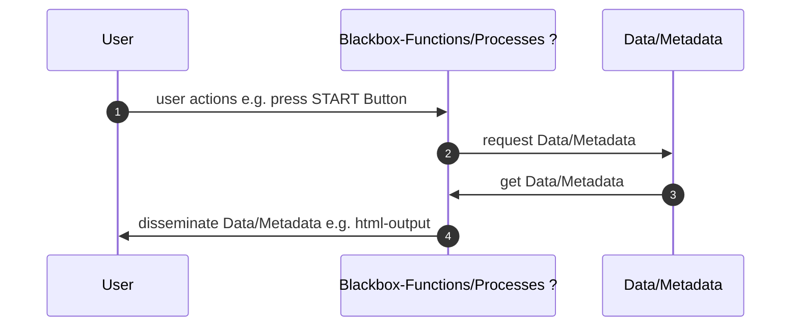

# Functions Template

# Projekt x

## Allgemein

### Frontend
...

### Backend
...

## Key User Actions

* Start
* ...

### Start
...

#### Frontend
...

#### Backend
....

Ablaufdiagramm

```mermaid
sequenceDiagram
autonumber
	participant U as User
    participant BB as Blackbox-Functions/Processes ?
    participant DMD as Data/Metadata
    
    U->>BB: user actions e.g. press START Button
    BB->>DMD: request Data/Metadata
    DMD->>BB: get Data/Metadata
    BB->>U: disseminate Data/Metadata e.g. html-output
    
```			